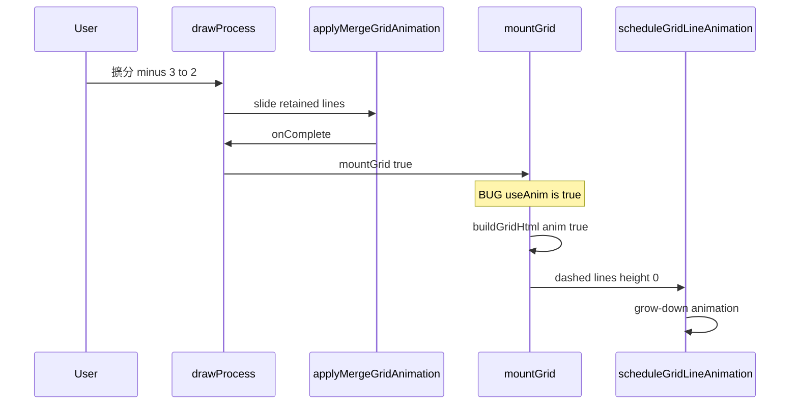

# Fix: Post-Slide Grow-Down Animation in FractionApp64

## Symptom

After a **slide** merge animation (擴分 minus when `old_s >= 3`, or 約分 plus when `old_s >= 3`), a second unwanted animation appears: **lines drawing from top to bottom** (dashed grow-down).

## Root cause (confirmed)

Two different animation systems are chained incorrectly on **擴分 minus** completion only.



**Buggy line** in [`js/FractionApp64.js`](js/FractionApp64.js) ~586:

```javascript
mountGrid(anim && fdVal !== 1);  // true when fdVal=2,3,...
```

`mountGrid(true)` does two things:

1. `buildGridHtml(..., useAnim=true)` — creates `.divider-anim-slot` + dashed `.anim-line` at `height:0%`
2. `scheduleGridLineAnimation(...)` — runs expand grow-down (`animateLineHeights` to 100%)

That is the **擴分 increase** animation, not a merge settle. It must never run after merge slide/pull.

**約分 plus** already avoids this — completion uses `buildGridHtml(..., false)` directly (line ~599). No bug there.

## Why the fix is safe

| Path | Current completion | Correct |
|------|-------------------|---------|
| 擴分 minus (slide or pull) | `mountGrid(anim && fdVal !== 1)` | `mountGrid(false)` |
| 約分 plus | `buildGridHtml(..., false)` | unchanged |
| 擴分 plus | `mountGrid(anim)` via normal path | unchanged |
| Initial load / no merge | `mountGrid(anim)` | unchanged |

After merge, the pedagogical moment is **already complete** (slide or pull-up). The final flex grid is a **static settle** — same as 約分.

`mountGrid(false)` still builds the correct grid; `scheduleGridLineAnimation` returns immediately when `!anim`.

## Implementation (single-line surgical fix)

**File:** [`js/FractionApp64.js`](js/FractionApp64.js)

Change expand-decrease `onComplete`:

```javascript
// Before
mountGrid(anim && fdVal !== 1);

// After
mountGrid(false);
```

**Do not change:**
- `applyMergeGridAnimation` slide/pull logic
- `buildGridHtml`, `scheduleGridLineAnimation` expand-increase path
- 約分 completion path
- CSS, number line, App47

## Verification

| Test | Steps | Expected |
|------|-------|----------|
| 擴分 minus slide | 2/8, mult 1→3→2 | Slide only, then **instant** static grid — no dashed grow-down |
| 擴分 minus pull | 2/8, mult 1→2→1 | Pull up only, then instant static grid |
| 約分 plus slide | 6/18, divisor 1→2→3 | Slide on 2→3 step, no grow-down after |
| 擴分 plus | mult up | Dashed grow-down still works |

**DevTools check:** After 3→2 minus, confirm zero `.divider-anim-slot` and zero `.anim-line-dashed` in DOM after animation ends.

## Rebuild

Run `python build.py` for `dist/FractionApp64(相等分數).html`.
