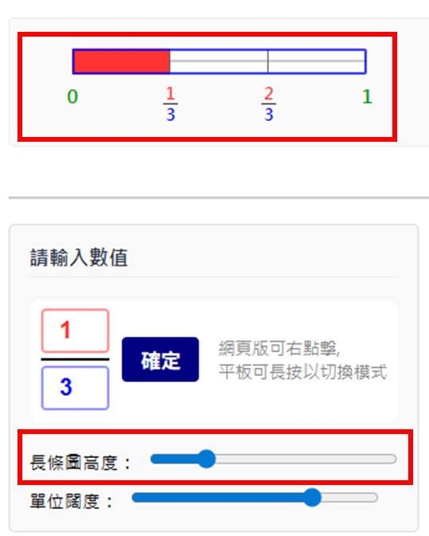
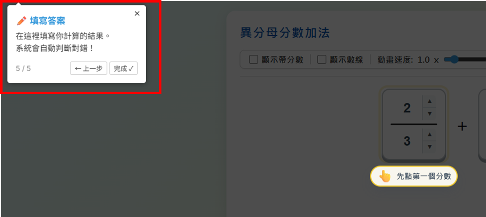
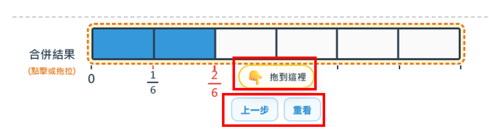
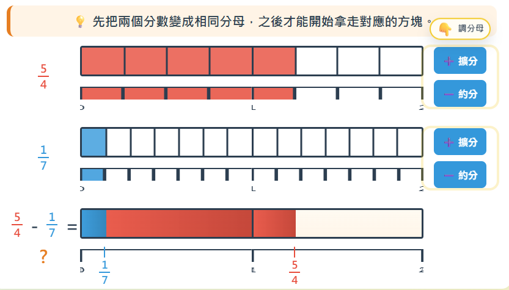
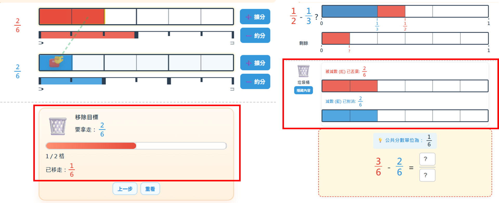
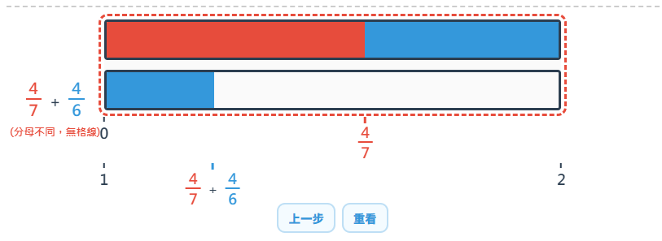
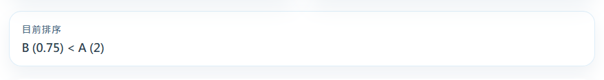
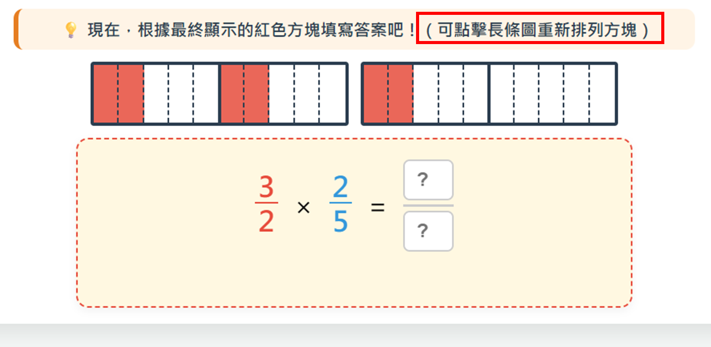

From the github.io, https://enoch-sit.github.io/fraction-arithmetic-learning-app/ , there are some update suggestions for us to discuss:

The apps 「分數擴分與約分」 and 「相等分數(約分/擴分)」 are the same. We need to confirm whether we should keep both or only one. 「相等分數(約分/擴分)」 is the latest version.

The app 「相等分數(約分/擴分)」 has issues with the whole UI design and functionality; users are unable to use or change the input number box. Please refer to the attached file: FractionApp64(相等分數).html.

For all apps, use square corners for all bar charts (長條圖). The UI for the bar chart should refer to the app 「異分母分數加法」, while the functionality should refer to the app 「整數與分數互換」.

The app 「整數與分數互換」 has a line in the bar chart, with the height at approximately 1/3.

In the app 「整數與分數互換」, the button 「確定」 is unnecessary, as the bar chart above and the info on the right update automatically. We should either cancel the automatic update or remove the button.

The app 「整數與分數互換」 does not include a tutorial setting.

In the apps 「異分母分數加法」,「異分母分數減法」,「分數乘法教學」,「異分母分數除法」, tutorial 5/5 displays in the incorrect location.

The app,「 異分母分數加法」,「異分母分數減法」,「分數乘法教學」,「異分母分數除法」, after clicking the button, 「顯示帶分數」, the input box does not have up and down arrows.

The app,「 異分母分數加法」, the 'incorrect bar' has overlap issues as show below.

The app,「 異分母分數加法」, the incorrect bar should not disappear after clicking other buttons.

The app,「 異分母分數加法」,  tips「拖到這裡」, incorrect display location;

The app,「 異分母分數加法」,「分數乘法教學」,「異分母分數除法」, the buttons 「上一步」and「重看」are not functional(maybe can delete, together with「 異分母分數減法」).

The app,「 異分母分數減法」， the display of 數線 got an error.

The app,「 異分母分數減法」， the 'incorrect bar' should display after dragging the faction bar above without getting the common denominator.

The app,「 異分母分數減法」， the trash bin should be displayed when both fraction bars are displayed.

The app,「 異分母分數減法」，the display in trash bin is incorrect, the length of each section of the bar chart should be equal, and showing two bars. Please refer to the image below(left: github; right:origan html). Please refer to the attach file: FractionApp48(Subtraction).html

The app,「 分數乘法教學」，the function of rearranging the bar is missing, please refer to the attached file: FractionApp45(Multiplication).html.

The app,「 分數比較」，delete「目前排序」, as it directly showing the answer to students.

The app,「 分數比較」，can fix the issue when changing between mode 1 and 2, the whole UI changes suddenly.

The app, 「整數的部份」is missing, please refer to the attached file: FractionApp65(整數的部份).

